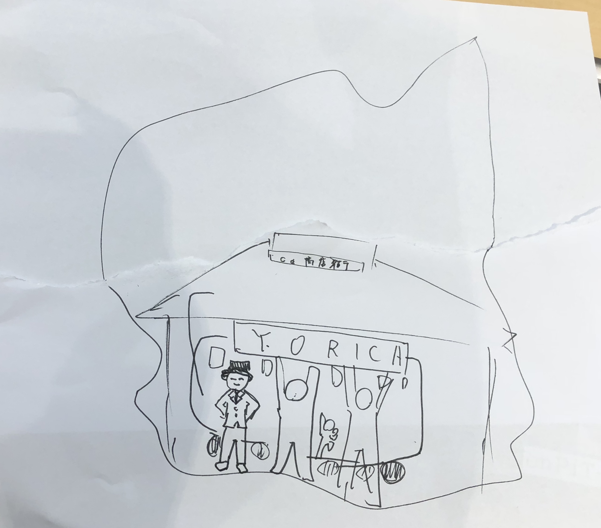

# 商店街のお店

 
 
 
 

# 連携店の外観

  
  
  
  

                                                     

 

YORICAとは、○○町商店街を中心に あなたと○○町をつなぐ 地域通貨です3

 

YORICAとは、○○町商店街を中心に あなたと○○町をつなぐ 地域通貨です

 

YORICAとは、○○町商店街を中心に あなたと○○町をつなぐ 地域通貨です3

 

YORICAとは、○○町商店街を中心に あなたと○○町をつなぐ 地域通貨です3

 

YORICAとは、○○町商店街を中心に あなたと○○町をつなぐ 地域通貨です3

